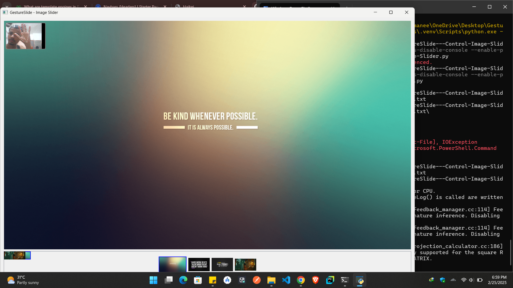

# 🚀 GestureSlide  

**Control Image Slides with Hand Gestures**  
GestureSlide allows users to navigate image slides using hand gestures, providing a seamless and futuristic user experience.

---

## 📌 Features  

| **Feature**                     | **Description**                                      |
|----------------------------------|------------------------------------------------------|
| **Gesture Control**              | Navigate slides using hand gestures                 |
| **AI-powered Detection**         | Uses AI for gesture recognition                     |
| **Customizable UI**              | Modify the UI according to your preference          |
| **Lightweight & Fast**           | Optimized for smooth performance                    |
| **Cross-Platform Support**       | Works on Windows and other supported OS             |

---

## 🛠 Tech Stack  

✅ **Programming Language(s):** Python  
✅ **Libraries Used:** OpenCV, Mediapipe
✅ **GUI:** PyQt  
✅ **Other Tools:** NumPy, Pip  

---

## 📦 Installation  

### **🔹 Prerequisites**  
- Python 3.10 installed  
- Required dependencies  

### **🔹 Setup Instructions**  
```sh
# Clone the repository
https://github.com/its-maneeshk/GestureSlide-Image_Slider.git

# Navigate into the project directory
cd GestureSlide-Image_Slider

# Create a virtual environment (optional but recommended)
python -m venv .venv
source .venv/bin/activate  # On Windows: .venv\Scripts\activate

# Install dependencies
pip install -r requirements.txt

# Run the application
python Image-Slider.py

```
🚀 Running the Project

```sh
python Image-Slider.py
```
## Note
### Step 1: Start the application.
### Step 2: Allow camera access.
### Step 3: Use hand gestures to navigate through images.
### Step 4: Close the application using the UI exit button.

---

## 📸 Screenshots  
| **Interface** | **Preview** |
|--------------|------------|
| **Application UI** |  |

📌 More detailed **UI screenshots** can be found in the project_images/ folder.

---

## 🔗 Contributing  

💡 **Want to contribute?** Fork the repo, create a branch, and submit a pull request. I welcome **bug fixes, feature improvements, and optimizations**.  

---

## 📬 Contact  

💻 **Developed by [Manish Patel](https://github.com/its-maneeshk)**  

📧 **Email:** [maneeshkurmii@gmail.com](mailto:maneeshkurmii@gmail.com)  
🔗 **LinkedIn:** [itsmaneeshk](https://www.linkedin.com/in/itsmaneeshk/)  
📷 **Instagram:** [its_maneeshk_](https://www.instagram.com/its_maneeshk_/)  

---

## 🏆 Tech Badges  

<p align="center">
  
  
  
  
  
</p>

---
